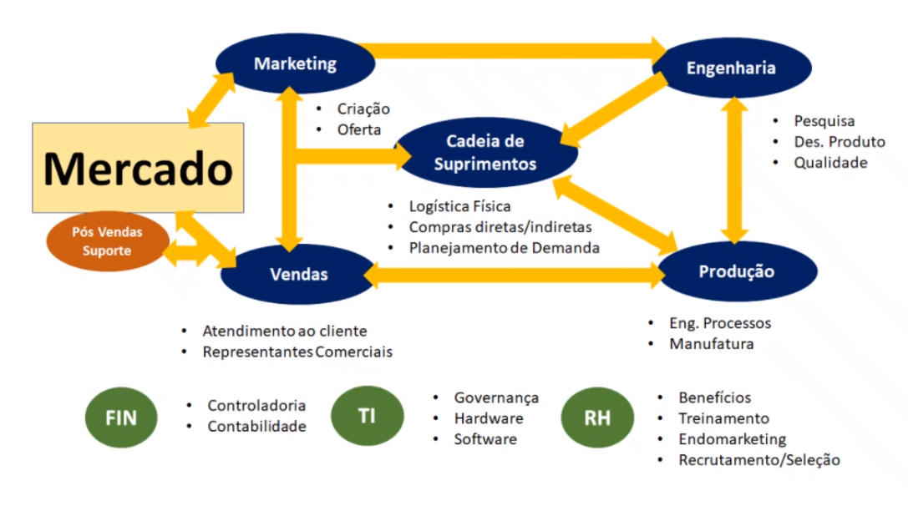

# Introdução à Análise de Dados em Ambiente Corporativo

Para o mercado de trabalho:
Ferramentas mais pedidas -> SQL, Power BI, Tableau, Excel
Diferencial -> Python, Inglês avançado

### O que é a Análise de dados?
- uso de processos e ferramentas para examinar bases de dados e identificar padrões

### Gerando inteligência
- **dados**: menor unidade de análise
- **informação**: relaciona dados, intervenção humana
- **análise**: juizo de valor sobre as informações
- **conhecimento**: aplicabilidade dos dados, análise e informações -> difícil de estruturar

### Como realizar uma análise de dados?

1. **Definição das perguntas**: o que eu quero melhorar?
2. **Defina o que medir**: indicadores - medir apenas aquilo que precisamos controlar
3. **Defina como medir**: prazo, fonte, fatores
4. **Faça a coleta dos dados**: quais informações vou coletar e de onde eu tiro?
5. **Faça a análise de dados**: manipulando gráficos, tabelas e filtros
6. **Interprete os resultados**: a resposta foi encontrada? Há limitações?

### Sistema de informações

- **Pesta**: ambiente político, social, ambiental
- **Concorrência**: inteligência de marketing
- **Business Intelligence**: como funciona o sistema interno
- **Clientes**: CRM

- Captura / Classifica / Analisa / Distribui

### Funcionamento de uma indústria

### Sistema ERP

- um sistema ERP é um software de gestão capaz de integrar todas as informações de uma empresa em diferentes módulos
- exemplos: SAP, TOTVS

### KPI

- Key Performance Indicator (indicadores)
- usados para medir resultados, métrica de desempenho
- exemplos: taxa de conversão de vendas, retrabalho, ROI, lead time de processos

### BIG DATA

- Velocidade × Volume × Variedade

### ETL - Extract, Transform and Load
- é o processo que leva mais tempo na análise
- todas as informações relevantes passam por ele

### Gráfico de Pareto

Conhecido como gráfico 80%-20%, 80% do problema está em 20% das causas