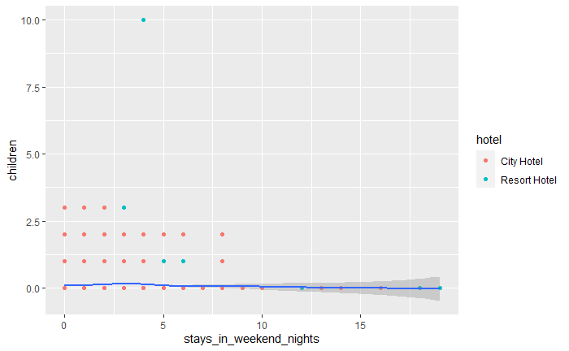

# GGPLOT2: pacote de visualização de dados em R

## 🎨 Atributos visuais

```r
  ggplot(data, aes(x=distance, y= dep_delay, 
    color=carrier, 
    size=air_time, 
    shape = carrier)) 
  + geom_point()
```
- **Cor - Color**: altera a cor de cada variável
- **Tamanho - Size**: altera o tamanho de cada variável
- **Forma - Shape**: altera o formato de cada variável

### Funções

- **Suavizar - Smoothing**: adiciona uma linha para ajudar na visualização de tendências
- Ex.:
```r
ggplot(data, aes(x=distance, 
y= dep_delay)) +
    geom_point() +
    geom_smooth()
```


## 📊 Tipos de plots - Geoms


## 🔗 Links úteis
- [Cheat Sheet de visualização de dados no ggplot2](https://ggplot2.tidyverse.org/)